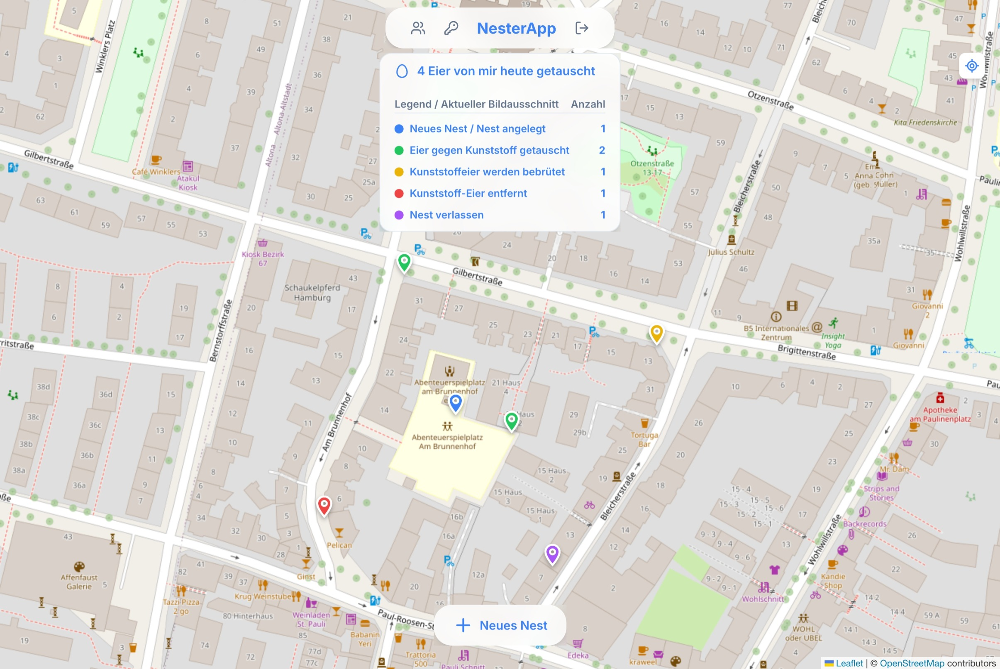
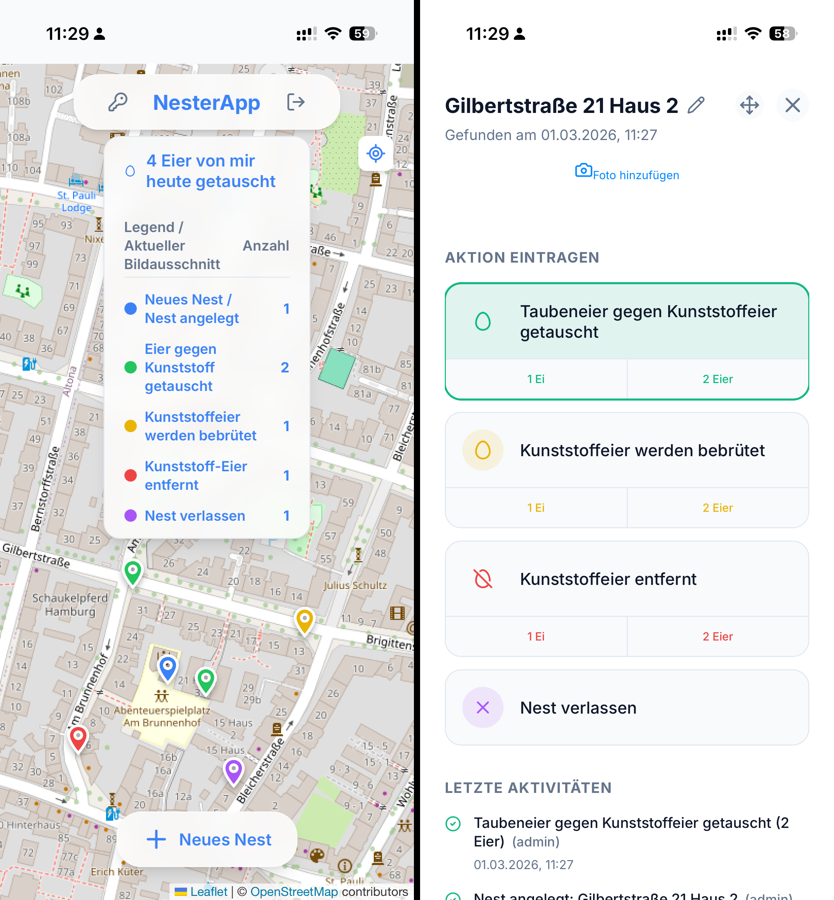

# NesterApp

NesterApp ist eine Open-Source-Webanwendung zur Erfassung und Verwaltung von Taubennestern in Städten. Sie bietet eine interaktive Karte zur Lokalisierung von Nestern, zur Protokollierung von Beobachtungen und zum Hochladen von Fotos mit dem Ziel, das tierschutzgerechte Management städtischer Taubenpopulationen zu unterstützen.

## Screenshots

### Browser

### Mobile

## Funktionen
- **Interaktive Karte**: Ansicht aller registrierten Nester mithilfe von Leaflet (OpenStreetMaps).
- **Berichterstattung**: Protokollierung von Aktivitäten, Statusaktualisierungen und Fotos für einzelne Nester.
- **Standortverfolgung**: Automatische Benennung basierend auf OpenStreetMap-Einrichtungen oder Straßenadressen.
- **PWA-fähig**: Kann auf Mobilgeräten für die Berichterstattung von unterwegs installiert werden.

## Erste Schritte

Siehe [INSTALLATION.md](INSTALLATION.md) für Anweisungen zur Einrichtung der lokalen Entwicklungsumgebung und zur Bereitstellung in der Produktion.

## Mitwirken

Wir freuen uns über Beiträge! Bitte lies [CONTRIBUTING.md](CONTRIBUTING.md) für Richtlinien, wie du helfen kannst.

## Lizenz

Dieses Projekt ist unter der GNU General Public License v3.0 lizenziert - siehe die Datei [LICENSE](LICENSE) für Details.
